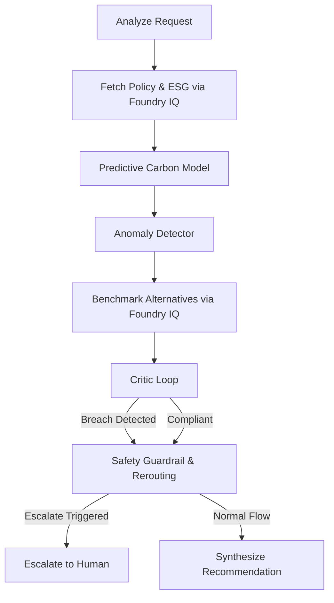

# 🌿 Eco-Budgeting Agent — Microsoft Agents League Hackathon

An intelligent corporate compliance auditor designed for the **Reasoning Agents** track, utilizing **Microsoft Foundry IQ** to enforce multi-dimensional ESG policies, audit carbon projection caps, and prevent supply chain concentration risk.

---

## 🚀 Track & Integration Summary

* **Hackathon Track**: `🧠 Reasoning Agents (Microsoft Foundry)`
* **Intelligence Layer Integration**: `Foundry IQ` (Enforces cited, grounded compliance guidelines for procurement and retrieves live supplier ESG statistics)
* **Reasoning Framework**: Stateful Chain-of-Thought (CoT) graph built with **LangGraph**

---

## 💡 Core Capabilities

1. **Stateful Graph Reasoning**: Executes a sequential 8-stage audit path where every node outputs standard-output logs and state modifications.
2. **Predictive Carbon Modeling**: Runs a linear velocity projection model assessing historical quarterly emission trends to forecast quarter-end footprints.
3. **Z-Score Anomaly Detection**: Calculates a Z-score of monthly emissions to flag sudden spikes ($> 2\sigma$) immediately in the reasoning log.
4. **Supplier Diversity Cap**: Evaluates supplier concentration rates, enforcing a strict **40% maximum allocation cap** per supplier.
5. **Autocorrection Loop**: If the critic node detects a carbon cap breach or supplier concentration violation, it automatically executes a **strategic pivot**, rerouting orders to cleaner, diversified alternative vendors.

---

## 🛠️ Graph Architecture

The agent's decision-making flow is governed by a stateful graph:



---

## 💻 Streamlit Explainability Dashboard

The dashboard provides a premium, interactive interface for audit review and mock scenarios:
* **What-If Simulator**: A slider to shift order allocations to Supplier B (*GreenCore Materials*) and watch the projected emissions and concentration values recalculate live.
* **Compliance Banner**: Color-coded panels indicating whether the current configuration satisfies both carbon budgets and diversity indexes.
* **Chain-of-Thought Audit expanders**: Styled containers mapping the agent's step-by-step reasoning details and structured JSON data.

---

## ⚙️ Quick Start

### 1. Install Dependencies
```bash
pip install langgraph langchain langchain-openai streamlit pandas
```

### 2. Run the Streamlit Dashboard
```bash
streamlit run app.py
```
Open **[http://localhost:8501](http://localhost:8501)** in your web browser.

### 3. Run the CLI Reasoning Test
```bash
python eco_budget_agent.py
```

---

## 📝 Submission Checklist (Deadline: June 14, 2026)

Before clicking submit on the Agents League platform:
1. **Initialize Git & Make Public**:
   Ensure this project directory is pushed to a public GitHub repository.
2. **Record a 2-3 Minute Demo Video**:
   * Open the Streamlit dashboard.
   * Demonstrate the **What-If Simulator** (e.g., show how shifting 20% to Supplier B achieves full compliance, while shifting 60% violates the 40% supplier concentration limit).
   * Expand one or two Chain-of-Thought logs to show judges the underlying LangGraph steps.
3. **Submit**:
   Enter your public GitHub repository URL and link your demo video in your Hackathon profile.
